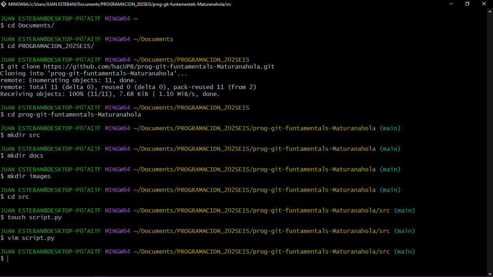
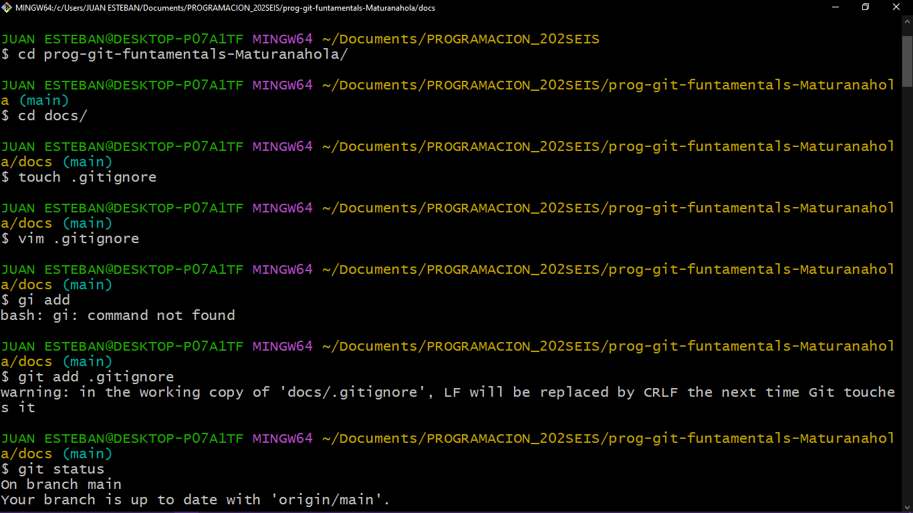
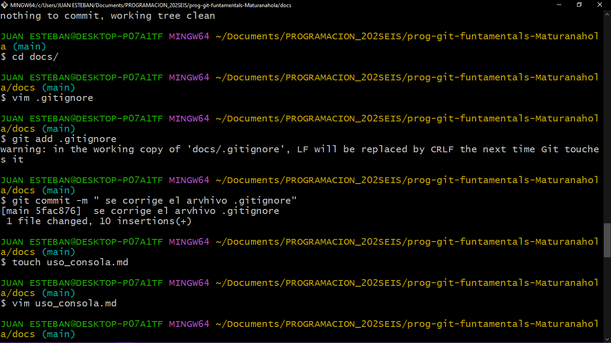

## Listado de Comandos Principales

Estos son los pilares para gestionar proyectos desde la terminal:

1. Navegación

pwd (Print Working Directory): Te muestra la ruta completa de la carpeta donde estás.

ls (List): Muestra los archivos y carpetas del directorio actual.

ls -a: Muestra también los archivos ocultos (como el .gitignore).

cd [carpeta] (Change Directory): Te mueve a la carpeta indicada.

cd ..: Te regresa una carpeta hacia atrás.

2. Creación y Gestión

mkdir [nombre] (Make Directory): Crea una carpeta nueva.

3. Visualización de Comandos en Acción

Para que veas cómo se ve esto en una terminal real, aquí tienes unos ejemplos visuales:

4. Estructura de navegación y listado

Cuando ejecutas ls o pwd, la terminal te devuelve la ubicación y el contenido de forma textual.

5. Creación de carpetas y archivos

Al usar mkdir y touch, verás que no hay un mensaje de confirmación (si no sale ningún error, ¡es que funcionó!). Luego puedes usar ls para verificar.

